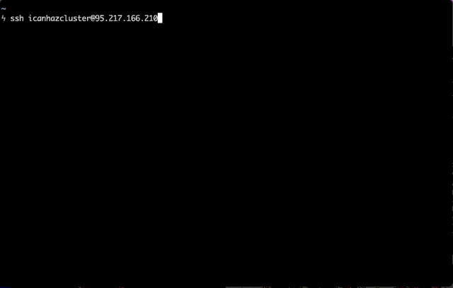

# K8s workshop in a box

This is a setup for running Kubernetes workshops using 'real' clusters,
without attendees having to install anything on their personal computers.

## How does it work?

This setup uses [Kind](https://kind.sigs.k8s.io/) to run a number of clusters isolated in Docker containers, on one big (cloud) server. Every participant of the workshop gets a 3 node Kubernetes cluster (one master two workers), running in 3 Docker containers per cluster.

The clusters are fully isolated, with their own internal IP space.

## Requirements

* A beefy (cloud) server. 
  * I used an AWS `m5.8xlarge` instance for a 15 person workshop, we had quite a bit of capacity left. Initialising the clusters is most resource intensive. Besides that it depends mostly on the workloads you're running during the workshop.
  * Running a three hour workshop costs about ~ 5$ this way. That's even cheaper than a pizza 🍕!
* Ubuntu 18.04 host OS. It may work with other Linux flavours, but the setup was only tested with Ubuntu 18.04 so far.
* SSH port open on the host node.

## Setup

1. Provision a host node, as described in Requirements above.
2. SSH into the node, clone this repository (`git clone https://github.com/kabisa/k8s-workshop-in-a-box.git`).
3. Run the `setup.sh` script with root privileges.
4. Create the desired number of clusters using `./create-clusters.sh <NUMEBR OF CLUSTERS>`. Best run this from screen/tmux as it will take a while (few minutes per cluster).
5. Done! 🙌

## Accessing the clusters

After the clusters are created, participants can claim their own cluster via SSH:

```
ssh icanhazcluster@<CLOUD SERVER IP>
```

An SSH command to connect to your personal cluster will be printed.
Here it is in action:



### (Re)starting clusters

Due to a limitation in KIND it is not possible to say "kind start cluster X" The command does not exist. You can read [this issue](https://github.com/kubernetes-sigs/kind/issues/148) 
The main limitation is, that Kind Nodes are just docker containers and there's no extra service running on your system to start these containers when you boot.
The solution is to simply start all containers manually. Since we know which containers are created for a cluster we've added the following command:

```bash
./start-clusters.sh
```

## Caveats

* This is horribly insecure, using unauthenticated SSH (for ease of use). It's probably best to only allow SSH access from the IP address of your workshop venue.
* This was tested with up to 15 clusters.
* Use at your own risk :-) 
